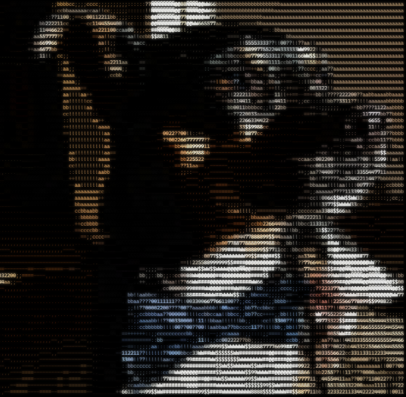
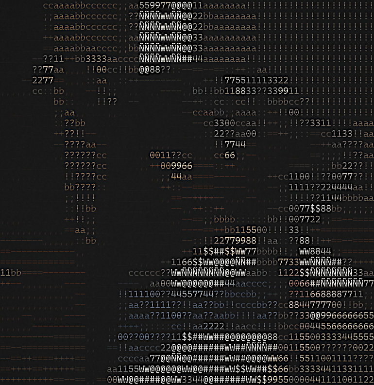
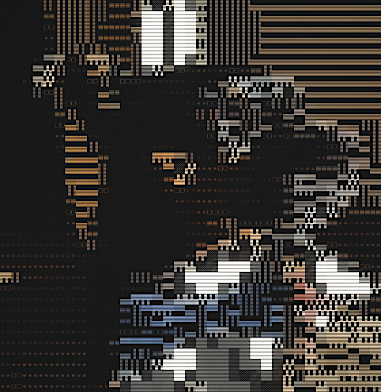
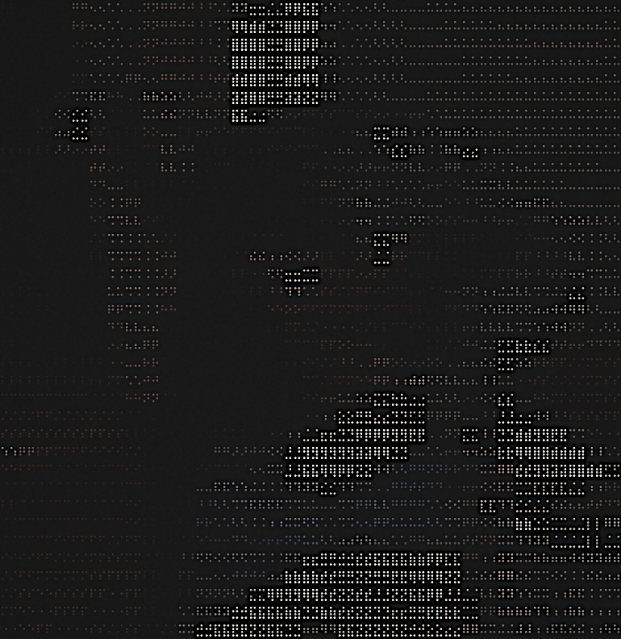
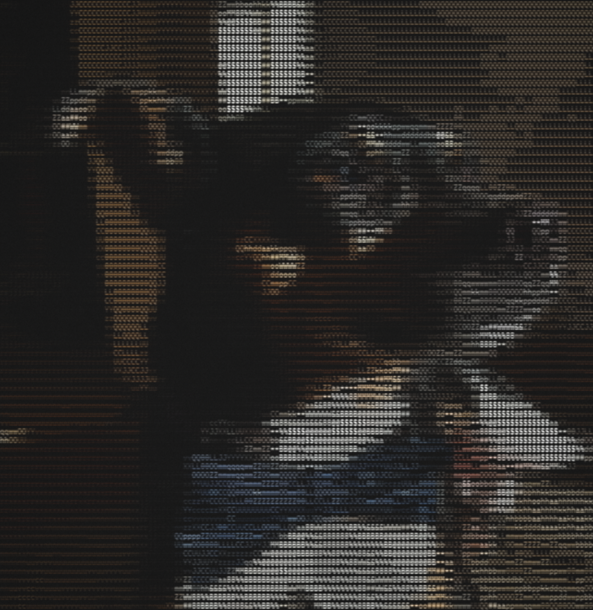
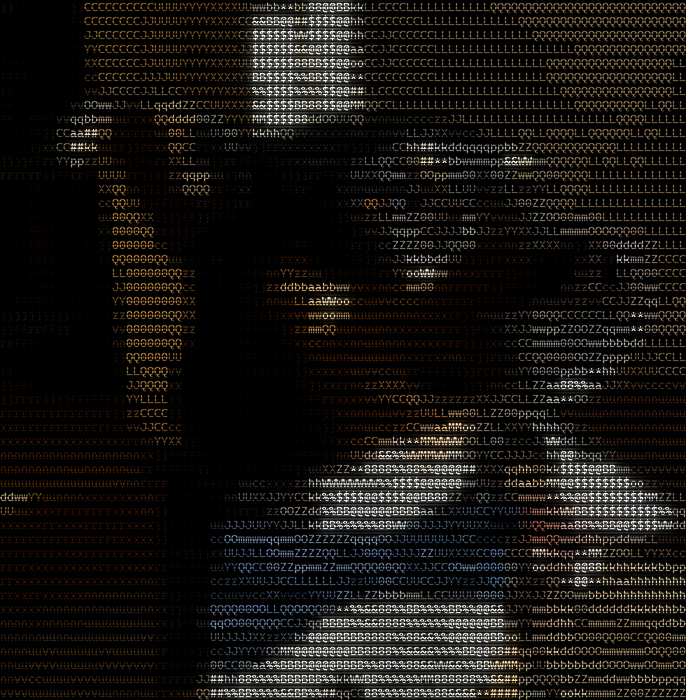
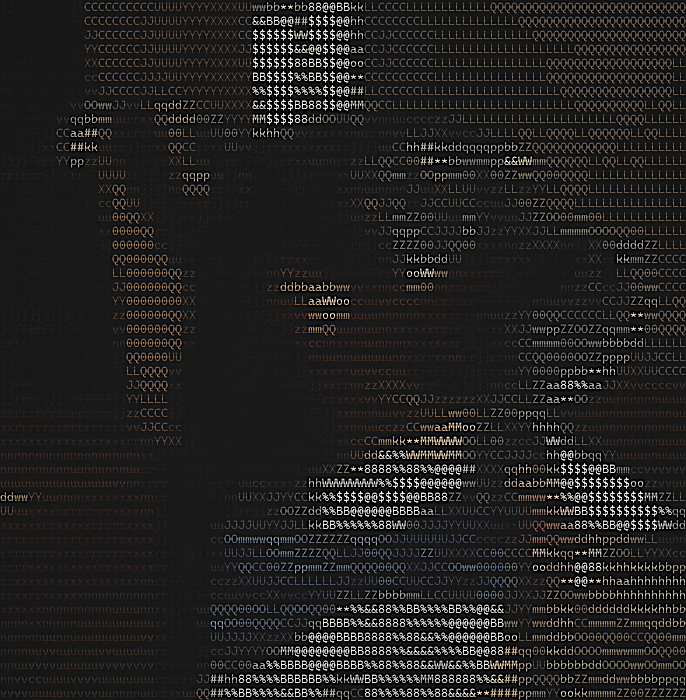
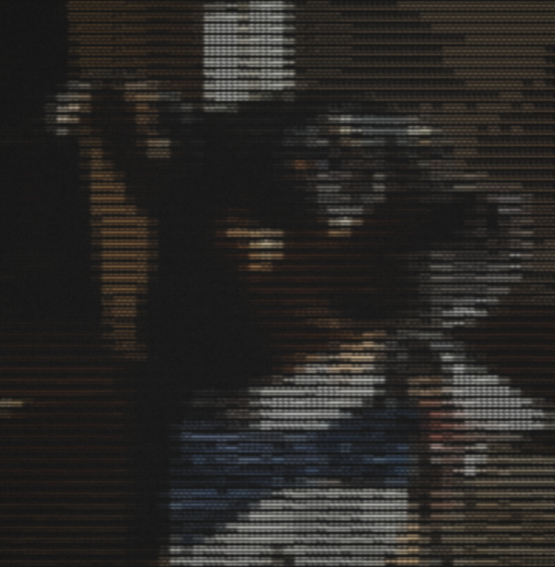
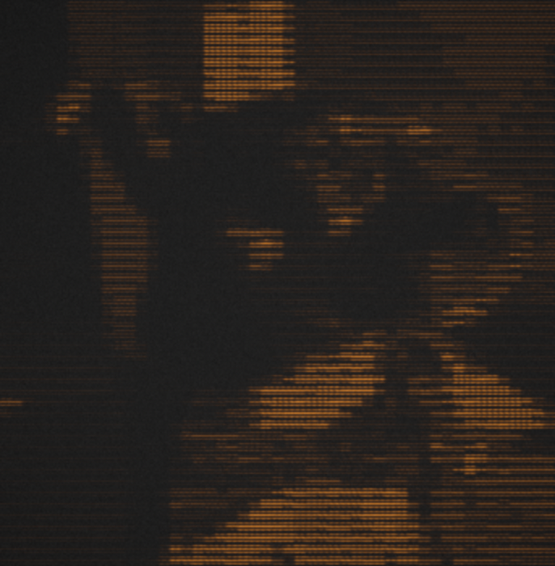
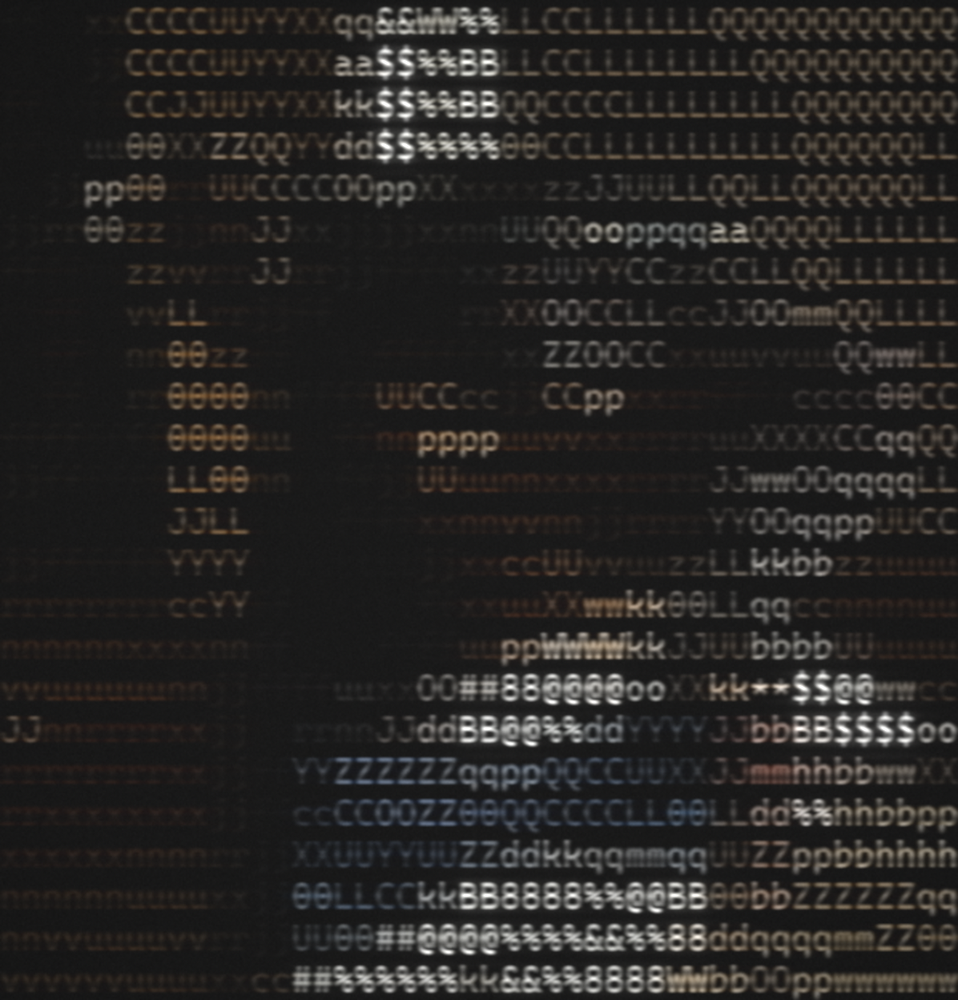

*<div align="right"> Vikram Procter | June 2022 - Sept 2026 </div>*

# ASCII Image Generator

## Project Overview
Started 2022, updated for cooler rendering in Sept 2026



*My dog Tia (... and yes she is wearing a bow tie!)*

A python script to convert image files into ASCII art, either drawn straight to the
console or rendered out as a high-resolution, print-ready image with a vintage CRT
terminal look.

A hobby project born out of my love for art and code. Loving both of these worlds I
wanted to put them together. With a few image files, some colourful ASCII escape codes,
and some inovative characters. Art can be *drawn* to the console with the hit of the
enter key.

The original engine mapped image brightness onto a 28 character density scale and
painted it to the terminal in the full 0-255 RGB colour space. That part still works
exactly as it always did. What is new in 2026 is everything downstream of it: the same
character grid can now be rasterised at any size you like, put through a physically
motivated CRT simulation, and written out as a lossless 16-bit file big enough to hang
on a wall.


*Francisco Goya - Saturno Devorando a Su Hijo*

---

## Quick Start

Set up the python environment:

`python -m venv .venv`  
`.venv\Scripts\activate`  
`python.exe -m pip install --upgrade pip`  

Now install the nessasary libraries:

`pip install numpy`  
`pip install pillow`

That is the whole dependency list. Two libraries, one file.

Draw it to the console, the way the project started:

```
python asciicrt.py ./path/to/img.jpg --rows 60 --show --no-raster
```

Render a 12x18 inch print at 300 DPI:

```
python asciicrt.py ./path/to/img.jpg --rows 180 --width-in 12 --height-in 18 --dpi 300 --preset classic -o print.png
```

Swap in `-o print.tiff` if your print shop wants a TIFF. Either format carries the
full 16-bit data.

Write it out as vector art instead:

```
python asciicrt.py ./path/to/img.jpg --rows 120 --svg art.svg --no-raster
```

Two commands worth remembering:

```
python asciicrt.py --list-ramps      # every character density ramp
python asciicrt.py --list-params     # every CRT parameter and its default
```

---

## How It Works

The program produces an artistic output in two halves. The first half is the original
engine, unchanged in spirit since 2022. The second half is the renderer that turns its
output into something printable.

### The ASCII pass

1. **Resize the image.** By reducing the image's resolution to match the resolution of
   the console characters the quality of the image can be retained. A box resizer
   averages proximal pixel values into a new resized pixel.
2. **Map brightness to characters.** For each pixel the grayscale brightness is found
   and mapped onto the **Character Density Scale**. This allows the brightness of pixels
   on the image to be translated to the console output via different characters. Kinda
   simulating a poor man's HDR.
3. **Colour each character.** For each pixel in the resized image an ANSI escape code is
   determined to apply the colour to the character.
4. **Emit the line.** Each character and its colour escape code is written out, either
   to the console or into a buffer for the renderer.

### The render pass

5. **Parse the ANSI** back into a grid of coloured cells. Every distinct character is
   rasterised exactly once into a glyph mask, then composited at an exact integer cell
   size so nothing drifts or seams.
6. **Simulate the tube.** Chroma bleed is applied to the gamma-encoded signal the way a
   composite video encoder would; everything after it runs in linear light, so glow adds
   like light rather than like paint.
7. **Write the file.** PNG or TIFF, 8 or 16 bit, with the correct DPI metadata baked in.

```
image file
     |
     |  area-average resize onto the character grid
     |  brightness -> character density scale
     v
ANSI strings  ------> --show (console)  ------> --svg (vector)
     |
     |  parse to a grid of (char, colour)
     |  glyph atlas, per-glyph font fallback
     |  composite at exact integer cell size
     |  CRT post-processing in linear light
     v
print-ready PNG / TIFF
```

---

## The Legacy Engine

The heart of the project is still the *character density scale*: a list of characters
ordered from the most filled in to the least filled in. Brightness picks a position on
that list.

The original 28 character scale ran from 'Ñ' to '_':

`Ñ@#W$9876543210?!abc;:+=-,._`

`charDencity = [chr(209), chr(64), chr(35), chr(87), chr(36), chr(57), chr(56), chr(55), chr(54), chr(53), chr(52), chr(51), chr(50), chr(49), chr(48), chr(63), chr(33), chr(97), chr(98), chr(99), chr(59), chr(58), chr(43), chr(61), chr(45), chr(44), chr(46), chr(95)]`

It is still in there as `--ramp original`, and the brightness mapping is bit-for-bit
identical to the 2022 code across all 256 grey levels. The resizer underneath it has
been replaced with one that handles non-integer scale factors, so the output lands on
exactly the row count you asked for and no edge pixels get cropped away.

Sixteen ramps ship with the tool. Some of the more interesting ones:

| ramp | characters | notes |
|---|---|---|
| `bourke` | 70 | Paul Bourke's density ramp, the default. Sliced to 40 with `--ramp-slice` |
| `original` | 28 | The 2022 scale |
| `blocks` | 20 | Unicode block and shading characters, very smooth gradients |
| `braille` | 96 | Every dot pattern is a different density. Really cool results |
| `shapes` | 23 | Geometric shapes, reads like a halftone |
| `math` | 38 | Chaotic but fun |
| `minimal` | 10 | Classic low-detail ramp, clean and legible |

Also available: `punc`, `punct`, `nums`, `letters`, `letterspure`, `lower`, `upper`,
`currency`, `arrows`. Any string longer than three characters is used as a literal
ramp, so `--ramp "@%#*+=-. "` works too.

| | | |
|:---:|:---:|:---:|
|  |  |  |
| `original` | `blocks` | `braille` |

---

## The 2026 Renderer

The console was always the limit. The art existed at whatever size the terminal font
happened to be, and a screenshot could never be bigger than the monitor it came from.

The renderer removes that ceiling. Instead of capturing pixels off a screen, it takes
the character grid and draws it again from scratch at whatever resolution you ask for.
A 12x18 inch print at 300 DPI is 3600x5400 pixels, and the tool renders every one of
them directly. Nothing is upscaled, nothing is screenshotted.



*Tia again, this time through the CRT renderer with the `classic` preset*

On top of that sits a CRT simulation built out of the things that actually happen inside
a cathode ray tube:

- **Composite chroma bleed** on the gamma-encoded signal, because colour bandwidth in
  analogue video is a fraction of luminance bandwidth
- **Beam defocus and phosphor bloom**, computed in linear light across three octaves
- **Halation**, the red-biased scatter of light through the glass
- **Scanlines** with a controllable beam profile, from a round gaussian beam to a hard
  square wave
- **Aperture grille**, black level lift, tube transfer curve, vignetting and analogue
  grain

Every spatial parameter is expressed in *cell units* rather than pixels, which means a
look you tune on a fast preview reproduces identically on a full-size print.

### Presets

| preset | optics | raster | good for |
|---|---|---|---|
| `none` | none | none | a clean, unprocessed terminal render |
| `clean` | none | hard square wave | sharp, bright, punchy shader look |
| `crisp` | minimal, with unsharp | round beam | CRT character with no softness cost |
| `subtle` | light | round beam | a gentle period flavour |
| `classic` | full | round beam | a photographed tube |
| `heavy` | heavy | round beam | a worn out monitor |
| `green` / `amber` | medium | round beam | monochrome phosphor |

| | |
|:---:|:---:|
|  |  |
| `clean` | `crisp` |
|  |  |
| `classic` | `amber` |

Small renders so the raster stays visible in the browser. On a full sheet the
scanlines read as texture rather than stripes.

---

## Command Line Reference

```
python asciicrt.py [IMAGE] [options]
python asciicrt.py --from-ansi FILE [options]
```

### ASCII generation

| Flag | Default | Description |
|---|---|---|
| `--rows N` | 180 | Art height in character rows. Columns follow from the source aspect |
| `--cols N` | auto | Force a column count instead of deriving it |
| `--ramp NAME` | `bourke` | Density ramp name, or any string longer than three characters used literally |
| `--ramp-slice N` | 40 | Use only the first N ramp characters. `0` uses all of them |
| `--gamma-y F` | 1.0 | Values above 1 lift every channel toward white before mapping |
| `--brightness-mode` | `mean` | `mean` averages the channels equally. `luma` is perceptually weighted |
| `--reps N` | 2 | Characters printed per source pixel horizontally |

### Outputs

| Flag | Description |
|---|---|
| `-o`, `--out FILE` | Raster render, `.png` or `.tif` |
| `--show` | Print the art to the terminal |
| `--svg FILE` | Vector output |
| `--svg-transparent` | Omit the background rectangle |
| `--dump-ansi FILE` | Save the raw ANSI stream |
| `--from-ansi FILE` | Load ANSI instead of generating it |
| `--no-raster` | Skip the raster render |
| `--bit-depth 8\|16` | 16 gives true 16-bit RGB |
| `--no-tiff-compress` | Uncompressed TIFF instead of Deflate |

### Geometry

| Flag | Default | Description |
|---|---|---|
| `--dpi N` | 300 | Output resolution, written into the file metadata |
| `--width-in F` / `--height-in F` | | Physical print size in inches |
| `--px-width N` / `--px-height N` | | Pixel size, overrides the inch flags |
| `--fit` | `contain` | `contain` letterboxes, `cover` crops, `stretch` fills |
| `--margin-in F` | 0 | Border drawn in `--bg` |
| `--preview` | off | Fast 1400px render at 96 DPI for tuning |

### Typography

| Flag | Default | Description |
|---|---|---|
| `--font PATH` | auto | Monospaced TTF or OTF |
| `--font-fallback PATH` | auto | Extra font for glyphs the main font lacks. Repeatable |
| `--cell-aspect F` | 2.0 | Cell height divided by width. Also sets the ASCII aspect |
| `--glyph-scale F` | 1.0 | Glyph size relative to the cell |
| `--baseline-nudge F` | 0.0 | Vertical shift in cell heights |
| `--bold-stroke F` | 0.0 | Synthetic bold width for ANSI bold text |
| `--supersample N` | 3 | Glyph oversampling |
| `--no-block-fix` | off | Stop drawing the full block as an exact filled rectangle |
| `--no-trim` | off | Keep blank rows at the top and bottom of the input |

### Colour

| Flag | Default | Description |
|---|---|---|
| `--bg` | `#000000` | Canvas colour |
| `--fg` | `#cccccc` | Colour for uncoloured text |
| `--palette` | `campbell` | Palette for 4-bit and 8-bit ANSI colours |

---

## CRT Parameters

Set any of these with `--set key=value`, load a set with `--params file.json`, or save
the resolved set with `--dump-params file.json`.

### Optics

| Parameter | Default | Description |
|---|---|---|
| `focus` | 0.045 | Isotropic beam defocus, in cell widths |
| `bloom` | 0.50 | Phosphor glow amount. The largest single influence on apparent softness |
| `bloom_radius` | 0.35 | Glow radius in cell heights, spread over octaves at 0.3x, 1.0x and 2.5x |
| `bloom_threshold` | 0.35 | Luminance above which pixels glow. Raise to confine glow to genuine highlights |
| `halation` | 0.30 | Red bias of the widest glow octave, the scatter of light through the glass |

### Analogue signal

| Parameter | Default | Description |
|---|---|---|
| `chroma_bleed` | 0.40 | Horizontal chroma smear in cell widths. Costs no sharpness, luminance is untouched |
| `luma_bleed` | 0.05 | Horizontal luminance smear in cell widths |

### Raster structure

| Parameter | Default | Description |
|---|---|---|
| `scanline_depth` | 0.75 | Scan line contrast. Applied in linear light, so a 2:1 ratio on screen needs roughly 0.79 here |
| `scanlines_per_row` | 3.0 | Scan lines per character row. Pitch is cell height divided by this |
| `scanline_sigma` | 0.19 | Beam half-width as a fraction of pitch. With a square wave the bright duty cycle is exactly twice this |
| `scanline_shape` | 1.0 | Beam cross-section. `1` is a round gaussian beam, `4` and above is a hard square wave |
| `scanline_phase` | 0.0 | Shifts the raster against the text grid. Matters below about 3px pitch |
| `mask_strength` | 0.0 | Aperture grille RGB stripe. Off by default |
| `mask_pitch` | 0.34 | Triad pitch in cell widths |

### Tube and colour

| Parameter | Default | Description |
|---|---|---|
| `phosphor` | `color` | `color`, `green`, `amber`, `white` or `blue` |
| `saturation` | 1.06 | Colour saturation, colour phosphor only |
| `beam_gain` | 0.75 | Restores highlight brightness lost to blurring thin strokes |
| `black_level` | 0.012 | Lifts blacks, since a tube never reaches true black |
| `contrast` | 1.05 | Tube transfer curve exponent |
| `brightness` | 1.0 | Linear multiplier |
| `gamma` | 1.0 | Extra gamma on top of sRGB |

### Finishing

| Parameter | Default | Description |
|---|---|---|
| `sharpen` | 0.0 | Unsharp mask amount, applied after the optics |
| `sharpen_radius` | 0.12 | Unsharp radius in cell widths |
| `vignette` | 0.22 | Corner falloff |
| `vignette_power` | 2.2 | Falloff curve. Higher confines it to the corners |
| `noise` | 0.010 | Analogue grain. Also dithers 8-bit banding |
| `noise_grain` | 2.0 | Grain size in pixels |
| `hum` | 0.0 | Mains hum brightness ripple |
| `seed` | 7 | Grain random seed |

---

## Tuning a Look

Cache the ANSI once so the ASCII pass never has to run again while you experiment:

```
python asciicrt.py photo.jpg --rows 180 --dump-ansi art.txt --preview
```

Then sweep a single parameter and get back a contact sheet of 1:1 centre crops, one
tile per value:

```
python asciicrt.py --from-ansi art.txt --sweep bloom=0,0.2,0.5,0.9
python asciicrt.py --from-ansi art.txt --sweep scanline_sigma=0.14,0.19,0.26
```

Lock in what you liked and commit to a full-size render:

```
python asciicrt.py --from-ansi art.txt --set bloom=0.2 --dump-params look.json
python asciicrt.py --from-ansi art.txt --params look.json --width-in 12 --height-in 18 --dpi 300 --bit-depth 16 -o print.tiff
```

A sweep rasterises the grid once and re-runs only the CRT chain per value, so it is
fast. Use `--sweep-full` for whole frames instead of crops and `--sweep-tile N` to
change the tile size.

### Sizing

The relationship that governs everything is:

```
canvas width in pixels = columns x cell width in pixels
```

Columns come from `--rows` and the source aspect, so at a fixed print width more rows
means smaller characters rather than more detail. At 12 inches and 300 DPI:

| columns | cell width | character |
|---|---|---|
| 240 | 15 px | fine texture, reads as a photograph from a distance |
| 180 | 20 px | balanced |
| 120 | 30 px | chunky, individual glyphs clearly legible |

Every run prints the cell size, the canvas size and the scanline pitch so you can see
where you have landed.



*Rendered with only 24 rows, so the cells come out at 38x76 pixels. Individual glyphs,
the phosphor glow around the highlights and the scan line pitch are all visible*

---

## Choosing a Source Image

Not every photo makes good ASCII art. The mapping throws away an enormous amount of
information, so the images that survive it are the ones that were already simple and
strongly lit.

**Fill the frame with the subject.** Anything near black becomes a space. A small
subject on a large dark background renders as a small amount of art surrounded by
nothing.

**Aim brighter than looks right.** This is the least obvious one. A glyph only inks
something like a third of its cell, so the render always comes out darker than the
source. A photo that looks correctly exposed on screen will render muddy. Push the
subject's midtones up around 0.5 to 0.6 before you start.

**Strong tonal separation.** The default ramp gives 40 discrete steps between empty and
solid. A flat, low-contrast image collapses into two or three characters and reads as
noise. Chiaroscuro is the ideal case, which is why the Goya works so well.

**A silhouette that reads small.** At 180 rows a face is perhaps 40 characters tall.
Anything finer than a cell is gone. Squint at the source: if you cannot tell what it is,
neither can the renderer.

**Saturated colour.** Every cell carries its own RGB, so colour does much of the work
that the characters cannot. Deep, distinct hues survive; muted palettes turn grey.

**Match the aspect ratio to the paper.** A 12x18 inch sheet wants a 2:3 source, or
`--fit contain` will letterbox it.

Subjects that tend to work: chiaroscuro paintings, portraits and pets lit with a hard
key against a dark background, neon and night city photography, silhouettes at sunset,
astrophotography, and anything with a clean graphic shape. Subjects that tend not to:
flat overcast landscapes, busy backgrounds, group shots, and anything where the subject
occupies a small part of the frame.

Screen a candidate in a couple of seconds before committing to a render:

```
python asciicrt.py candidate.jpg --rows 50 --show --no-raster
```

If it does not read in the terminal at 50 rows, no amount of CRT processing will save it.

### A note on `--gamma-y`

It is tempting to reach for `--gamma-y` when a render comes out dark, but it lifts every
channel toward white, background included, so the black around the subject turns grey
and the whole image washes out. It is a fade-to-white, not a brightness control. If a
render is too dark, fix the source first, then reach for the CRT `brightness` parameter,
which multiplies in linear light and leaves true black alone:

```
python asciicrt.py photo.jpg --rows 70 --set brightness=1.6 -o out.png
```

---

## Fonts

The tool searches for a monospaced font automatically: Cascadia and Consolas on Windows,
Menlo and SF Mono on macOS, DejaVu Sans Mono, Liberation Mono and Noto Sans Mono on
Linux. Override it with `--font`.

Font coverage matters for the more adventurous ramps. Several common monospaced fonts,
DejaVu Sans Mono among them, carry no Braille Patterns at all, which would leave the
`braille` ramp rendering as empty boxes. The glyph atlas detects a missing glyph by
comparing each render against that font's own `.notdef` and pulls the character from a
fallback font instead:

```
note   : 89 glyph(s) not in DejaVuSansMono.ttf, taken from DejaVuSans.ttf
```

Anything no available font can draw is reported rather than silently dropped. Add your
own with `--font-fallback`, which can be repeated.

The full block character is drawn as an exact filled rectangle rather than a glyph, so
block ramps tile without hairline seams between cells.

---

## Output Formats

| | |
|---|---|
| `--bit-depth 8` | PNG or TIFF with resolution metadata, dithered to remove banding in glow gradients |
| `--bit-depth 16` | True 16-bit RGB, written directly against the PNG and TIFF specifications |

Everything is lossless. No ICC profile is embedded; the data is sRGB, so tag it as such
if a print lab asks for one.

Note that Pillow downconverts 16-bit RGB when reading, so opening a 16-bit file with it
will report 8-bit. Check depth in Photoshop, GIMP or Affinity instead.

The SVG exporter writes each run of same-coloured characters as one `<text>` element
with an explicit `textLength`, so spacing stays exact no matter which font the viewer
substitutes.

---

## Performance

A 12x18 inch render at 300 DPI is 3600x5400 pixels, or 19.4 megapixels, and takes about
70 seconds and 2.5 GB of memory, producing a roughly 90 MB 16-bit TIFF.

Memory scales with pixel count, so a 24x36 inch poster at 300 DPI wants around 10 GB.
Drop to 200 DPI or render in halves if that is a problem. The CRT chain dominates the
runtime; rasterising the glyphs takes only a few seconds. Large radius blurs are
computed on downsampled copies and separable box passes approximate the gaussians.

---

## Generating the Example Images

Every image in this README can be regenerated from a source photo. Substitute your own
file for `./img/source/tia.jpg` throughout.

These are all web-sized 8-bit renders. `--bit-depth 8` matters here: the default is 16,
which is right for printing but turns a full sheet into a 100 MB file that has no
business living in a git repository.

The hero render, a whole sheet scaled down for the browser. Because every CRT parameter
is measured in cell units, this looks the same as the 300 DPI version, just smaller.
Note the low row count: 1600 pixels across 70 rows leaves 17px cells, which is enough
for the glyphs to survive the CRT chain. Ask for 150 rows at this width and the cells
drop to 7px and the whole thing turns to mush:

```
python asciicrt.py ./img/source/tia.jpg --rows 70 --px-width 1600 --dpi 96 --bit-depth 8 --preset classic -o ./img/crt_hero.png
```

The four preset tiles:

```
python asciicrt.py ./img/source/tia.jpg --rows 50 --px-width 700 --bit-depth 8 --preset clean   -o ./img/preset_clean.png
python asciicrt.py ./img/source/tia.jpg --rows 50 --px-width 700 --bit-depth 8 --preset crisp   -o ./img/preset_crisp.png
python asciicrt.py ./img/source/tia.jpg --rows 50 --px-width 700 --bit-depth 8 --preset classic -o ./img/preset_classic.png
python asciicrt.py ./img/source/tia.jpg --rows 50 --px-width 700 --bit-depth 8 --preset amber   -o ./img/preset_amber.png
```

The three ramp comparisons. `--ramp-slice 0` uses the whole ramp rather than the first
40 characters:

```
python asciicrt.py ./img/source/tia.jpg --rows 36 --px-width 800 --bit-depth 8 --ramp original --ramp-slice 0 --preset crisp -o ./img/ramp_original.png
python asciicrt.py ./img/source/tia.jpg --rows 36 --px-width 800 --bit-depth 8 --ramp blocks   --ramp-slice 0 --preset crisp -o ./img/ramp_blocks.png
python asciicrt.py ./img/source/tia.jpg --rows 36 --px-width 800 --bit-depth 8 --ramp braille  --ramp-slice 0 --preset crisp -o ./img/ramp_braille.png
```

The detail shot, a small number of rows at print resolution so the cells come out large
enough to inspect:

```
python asciicrt.py ./img/source/tia.jpg --rows 24 --px-width 1200 --dpi 300 --bit-depth 8 --preset classic -o ./img/detail_100.png
```

And the console version at the top of the page:

```
python asciicrt.py ./img/source/tia.jpg --rows 60 --show --no-raster
```

---

## Roadmap

Things the renderer does not do yet, roughly in the order they are worth adding:

- Screen curvature and barrel distortion
- RGB subpixel structure at print scale, building on `mask_strength`
- Glass reflections and a bezel
- Interlace flicker
- Per-channel convergence error
